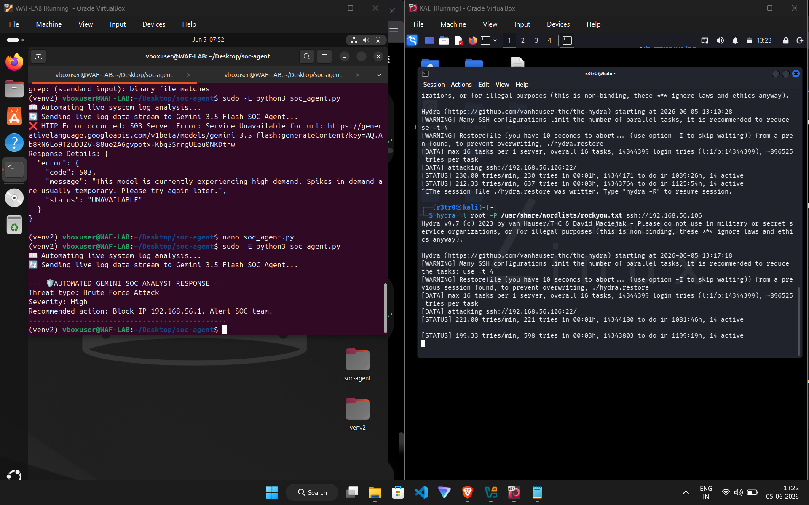

# Project 4: AI-Powered SOC Analyst Agent

## Overview
Built an AI-driven Security Operations Center (SOC) analyst using Python that automatically analyzes logs and classifies security events based on a custom SOC playbook.

## Tools & Technologies
- Python 3
- Airia AI / Groq / OpenAI API
- SOC Playbook (Rule-based reasoning)
- Kali Linux + Log generation

## Features
- Automated log analysis
- Threat classification (Brute Force, SQL Injection, etc.)
- Playbook-driven decision making
- Human-readable reports

## Screenshots

## What I Learned
- How to integrate AI into SOC workflows
- Prompt engineering for security use cases
- Building automated alert triage systems

[View Code → soc_agent.py](soc_agent.py)