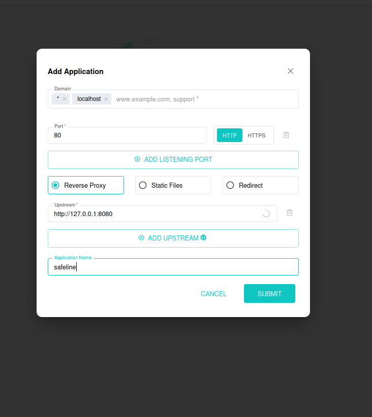
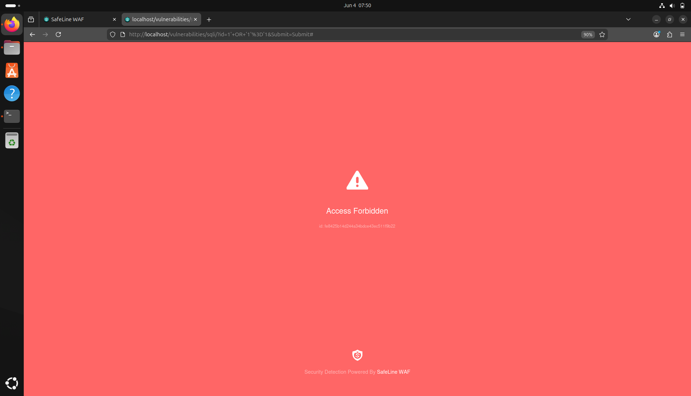
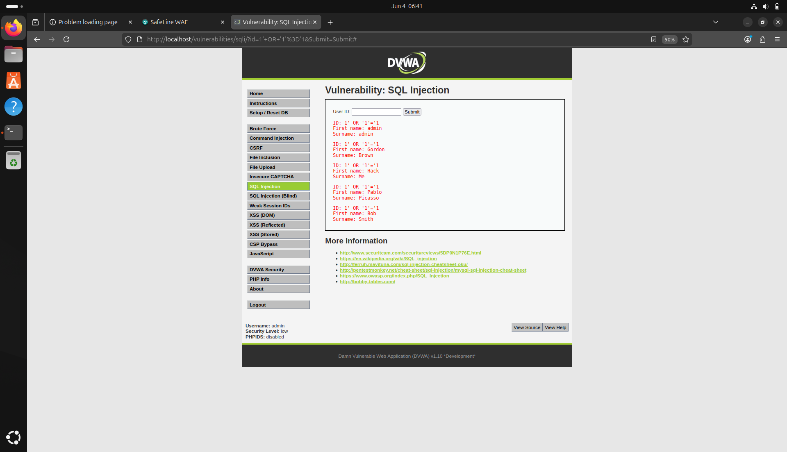
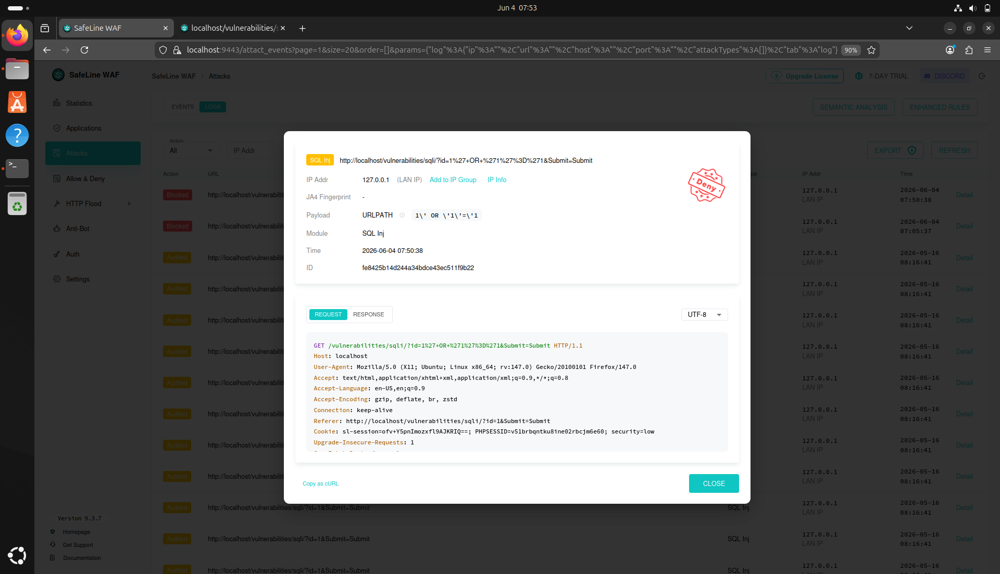
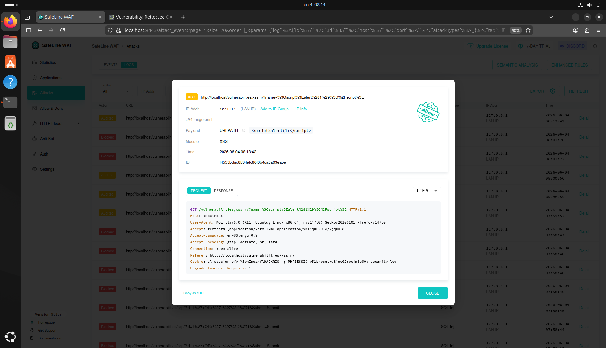

# Project 1: SafeLine Web Application Firewall (WAF) + DVWA

## 📋 Project Overview
Deployed **Damn Vulnerable Web Application (DVWA)** and protected it using **SafeLine WAF**. Successfully demonstrated prevention of **SQL Injection & XSS** attack.

## 🛠️ Tools & Technologies
- Ubuntu 22.04
- Docker + Docker Compose
- DVWA
- SafeLine WAF

## Objective
Deploy an enterprise-grade reverse-proxy Web Application Firewall (SafeLine) to protect a deliberately vulnerable web application (DVWA), validate threat mitigation against multi-vector web attacks, and analyze security telemetry within a localized SOC matrix.

## System Architecture & Topology
- **Host OS:** Ubuntu 22.04 LTS (Docker Engine environment)
- **Protected Asset:** Damn Vulnerable Web Application (DVWA) hosted natively on container port `8080`
- **Security Boundary:** Chaitin SafeLine WAF acting as an inline Reverse Proxy on host port `80`

## Implementation Steps
1. Isolated the environment using a VirtualBox Host-Only Adapter network structure.
2. Deployed the DVWA target container via Docker-Compose, shifting its host mapping to port `8080:80` to avoid local host routing conflicts.
3. Installed Chaitin SafeLine WAF using the official deployment utility scripts.
4. Configured an upstream proxy application route (`http://172.17.0.1:8080`) to ensure all incoming host port 80 traffic parsed cleanly through the semantic inspection engine before reaching the target backend database.
5. Escalated SQL rule parameters to **Strict Defense/Interception Mode**.

## Attack Vectors Tested & Remediated
- **SQL Injection (SQLi):** Executed a classic logical bypass payload (`1' OR '1'='1`) and an advanced data-exfiltration attempt (`1' UNION SELECT null, user(), null-- -`). 
  * *Result:* **Blocked.** WAF intercepted payload string matching patterns, returning a `403 Forbidden` drop action.
- **Cross-Site Scripting (Reflected XSS):** Injected a malicious payload string (``).
  * *Result:* **Blocked.** Detected unescaped HTML tag inputs.
- **Command Injection / Remote Code Execution (RCE):** Appended an unauthorized host system command string via shell delimiters (`127.0.0.1; cat /etc/passwd`).
  * *Result:* **Blocked.** Prevented interaction with system-level utilities.

## Implementation & Validation Visuals

### 1. Reverse Proxy Application Routing Setup

### 2. Multi-Vector Attack Mitigation (SQLi/XSS Drop Action)

### 3. SQL injection or XSS attack on DVWA before and after 

## Telemetry & Logging Analytics
All attack sequences successfully generated detailed, high-severity telemetry alerts within the SafeLine centralized console, logging malicious payloads, original client source footprints, attack families, and matching rule metrics.
